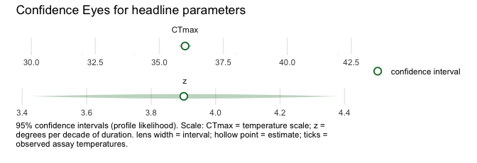
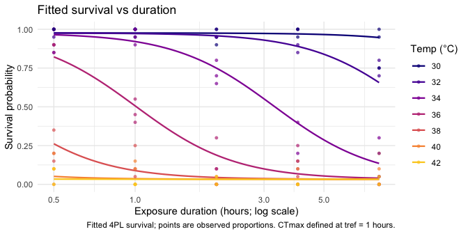
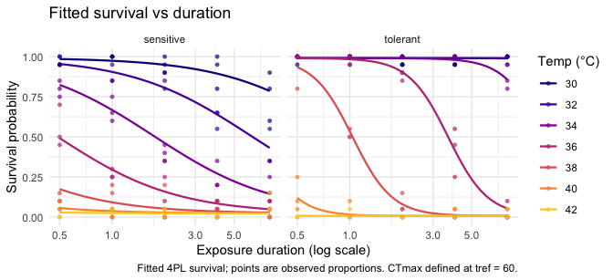

<!-- README.md is generated from README.Rmd. Please edit that file -->

# freqTLS

> Fast, prior-free frequentist confidence intervals — Wald,
> profile-likelihood, and bootstrap — for thermal-load-sensitivity
> (thermal death-time) models; the maximum-likelihood complement to
> `bayesTLS`.

<!-- badges: start -->

[](https://lifecycle.r-lib.org/articles/stages.html#experimental)
[](https://github.com/itchyshin/freqTLS/actions/workflows/R-CMD-check.yaml)
[](https://github.com/itchyshin/freqTLS/actions/workflows/pkgdown.yaml)
[-blue.svg)](https://www.gnu.org/licenses/gpl-3.0.en.html)
<!-- badges: end -->

`freqTLS` fits the single-stage four-parameter logistic (4PL) thermal
death-time model by maximum likelihood via
[TMB](https://github.com/kaskr/adcomp), parameterised **directly** in
`CTmax` (critical thermal maximum) and `z` (thermal sensitivity). It
then returns prior-free **frequentist confidence intervals** — Wald,
profile-likelihood (asymmetry-respecting), and bootstrap — for binomial
and beta-binomial survival counts, and for continuous **proportion**
responses in `(0, 1)` via the beta family.

Its signature display is the **Confidence Eye**: a pale horizontal lens
spanning the likelihood interval, with a hollow point estimate. These
are likelihood *confidence* intervals, not posteriors, so the visual
deliberately avoids posterior-density iconography, and the prose never
uses “posterior” or “credible” language.



## What freqTLS does

- Fits the 4PL thermal death-time model by **maximum likelihood**,
  directly in `CTmax` and `z`, for **binomial** and **beta-binomial**
  survival counts and continuous **beta** proportions in `(0, 1)` (no
  trials column needed).
- Inverts the likelihood-ratio test to give **profile-likelihood
  confidence intervals** that respect asymmetry and carry no prior.
- Surfaces **identifiability** honestly: when a profile does not close,
  it is flagged, never fabricated. By default `confint()` then falls
  back to a prior-free **parametric bootstrap** so an interval is still
  returned (set `fallback = FALSE` to keep the open profile, which the
  Confidence Eye draws as an open lens).
- Ships a tidy column interface (`fit_tls()`) and a
  `brms`/`drmTMB`-style **formula interface** (`tls_bf()`) with
  fixed-effect predictors on any sub-parameter (`CTmax`, `log_z`, `low`,
  `up`, `log_k`), plus prediction, lethal-time derivation, and plotting
  (survival curves, the survival surface, and the Confidence Eye).
- Fits **random intercepts** on `CTmax`, `log_z`, `low`, and `log_k`
  (`<param> ~ <fixed> + (1 | group)`), with profile intervals for the
  fixed effects; they combine freely, and sharing a grouping factor fits
  *independent* variances (no correlation term) and warns.
- Derives critical temperatures — `derive_ctmax()` (absolute threshold)
  and `derive_tcrit()` (rate-multiplier) — and predicts **heat injury**
  under a temperature trace (`predict_heat_injury()`) with a prior-free
  bootstrap confidence band (`heat_injury_envelope()`,
  `plot_heat_injury()`). See `vignette("frequentist-and-bayesian")` for
  how the likelihood and Bayesian paths compare.

## Why not the two-stage workflow

The classical workflow fits a curve per temperature, then regresses the
derived endpoints in a second stage. That discards the joint
uncertainty: the second-stage standard errors treat noisy first-stage
estimates as fixed, and the design’s identifiability is invisible.
`freqTLS` fits **one** model to all the counts at once and inverts the
likelihood for `CTmax` and `z` directly, so the interval reflects the
whole design and flags weakly identified parameters.

## How it differs from bayesTLS

`freqTLS` and [`bayesTLS`](https://github.com/daniel1noble/bayesTLS) fit
the **same model**. Under the matched constant-shape configuration they
target the same likelihood and the same fitted curve; they differ only
in how uncertainty is summarised.

|  | `bayesTLS` | `freqTLS` |
|----|----|----|
| Inference | Bayesian posterior (MCMC / Stan) | Maximum likelihood + profile likelihood |
| Intervals | Credible intervals (prior-informed) | Confidence intervals (prior-free) |
| Needs Stan / MCMC | Yes | No |
| Speed | Sampling (seconds to minutes) | Optimisation (~ms to ~1 s; see the timing table in `vignette("comparing-to-bayesTLS")`) |
| Always returns an interval | Yes (posterior) | Yes (profile; parametric-bootstrap fallback) |
| Extras | Heat-injury and repair sub-models, priors | Explicit non-closing / identifiability flags |

Use `freqTLS` when you want fast, prior-free, asymmetry-respecting
intervals and an explicit identifiability check; when a profile does not
close it falls back to a parametric bootstrap, so it returns an interval
even on hard designs. Use `bayesTLS` when you want a full Bayesian
workflow, prior information, or the heat-injury and repair sub-models.
The two are complementary lenses on the same model, not competitors.

## Installation

Install the development version from
[GitHub](https://github.com/itchyshin/freqTLS):

``` r
# install.packages("pak")
pak::pak("itchyshin/freqTLS")
```

## Quick start

The workflow mirrors `bayesTLS` — **standardize → fit → quantities →
plot** — so most `bayesTLS` analyses run on `freqTLS` by changing little
more than the package the data and functions come from. The engine is
maximum likelihood (no Stan, no MCMC, no internet); uncertainty is a
frequentist trio (Wald, profile, bootstrap) instead of a posterior. A
few differences are deliberate and documented in
`vignette("comparing-to-bayesTLS")`: the absolute (p-survival) threshold
and non-default asymptote `bounds` are outside the experimental 0.1.0
fitting boundary (fit on the relative midpoint, then convert with
`extract_tdt()`); uncertainty comes as bootstrap replicates rather than
posterior draws; and the temperature effect defaults to the
constant-shape configuration.

``` r
library(freqTLS)

# 1. Standardize raw survival counts (the shared bayesTLS entry point)
dat <- simulate_tls(family = "beta_binomial", CTmax = 36, z = 4, phi = 50, seed = 1)
std <- standardize_data(dat, temp = "temp", duration = "duration",
                        n_total = "total", n_surv = "survived")

# 2. Fit the 4PL by maximum likelihood, directly in CTmax and z
fit <- fit_4pl(std, t_ref = 1)

# 3. Headline thermal-death-time quantities with profile-likelihood intervals
tls(fit)
#> <tls> relative threshold; quantities: z, CTmax (profile intervals)
#> # A tibble: 2 × 4
#>   quantity median lower upper
#>   <chr>     <dbl> <dbl> <dbl>
#> 1 CTmax     36.0  35.7  36.3 
#> 2 z          3.90  3.43  4.38
```

For per-group CTmax/z, pass formulas —
`fit_4pl(dat, ctmax = ~ 0 + species, z = ~ 0 + species)` — exactly as in
`bayesTLS`. `extract_tdt()`, `predict_survival_curves()`, and
`diagnose_tdt_fit()` complete the twin surface; the column / formula
engine interface (`fit_tls()`, `tls_bf()`) remains available underneath.

``` r
# 4. Plot the fitted survival surface (the Confidence Eye is shown above)
plot_survival_curves(fit)
```



## Formula interface

If you prefer a grammar, build the model with `tls_bf()` and pass it as
the first argument with the data in `data =`. The left-hand side names
the survival counts (`successes | trials(total)`); the right-hand side
tags the two axes with the `time()` and `temp()` markers. The formula
path feeds the **same** likelihood engine, so the fits are numerically
identical:

``` r
# Column form and formula form fit the same model:
fit_f <- fit_tls(
  tls_bf(survived | trials(total) ~ time(duration) + temp(temp)),
  data   = dat,
  family = "beta_binomial",
  tref   = 1
)
all.equal(coef(fit_f), coef(fit))
#> [1] TRUE
```

Add a sub-parameter formula for any predictor on `CTmax` or `log_z` (for
example `CTmax ~ life_stage` for a grouped fit).

## Random effects on CTmax and z

When thermal tolerance varies across colonies, clutches, or populations,
add a **random intercept on `CTmax`** with `CTmax ~ 1 + (1 | group)`.
freqTLS fits it by maximum likelihood through TMB’s Laplace
approximation (matching the `bayesTLS` random-effects-on-the-midpoint
configuration), reports the between-group standard deviation as
`sigma_CTmax`, and returns the group BLUPs via `ranef()`. The
no-random-effects path stays byte-identical to the fixed-effects model.

``` r
# 15 colonies whose CTmax varies with SD = 1.5 C.
dre <- simulate_tls(family = "binomial", CTmax = 36, z = 4,
                    re_sd = 1.5, n_re_groups = 15, seed = 1)
fit_re <- fit_tls(
  tls_bf(survived | trials(total) ~ time(duration) + temp(temp),
         CTmax ~ 1 + (1 | colony)),
  data = dre, family = "binomial", tref = 1
)
# Between-colony SD of CTmax (with a Wald interval):
tp <- tidy_parameters(fit_re)
tp[tp$parameter == "sigma_CTmax", c("parameter", "estimate", "conf.low", "conf.high")]
#> # A tibble: 1 × 4
#>   parameter   estimate conf.low conf.high
#>   <chr>          <dbl>    <dbl>     <dbl>
#> 1 sigma_CTmax     1.48     1.03      2.12

# Colony BLUPs (deviations from the population CTmax):
head(ranef(fit_re), 3)
#> # A tibble: 3 × 4
#>   group term  estimate std.error
#>   <chr> <chr>    <dbl>     <dbl>
#> 1 g1    CTmax   -1.03      0.390
#> 2 g10   CTmax   -0.651     0.390
#> 3 g11   CTmax    2.05      0.390
```

A random intercept on **thermal sensitivity** works the same way, with
`log_z ~ 1 + (1 | group)`. Because `z` is modelled on the log scale, the
deviation is Gaussian on `log(z)` and `sigma_logz` is a standard
deviation on `log(z)` — read `exp(sigma_logz)` as the approximate
multiplicative spread of `z` across groups, not a z-scale SD. The two
intercepts can be combined; with the **same** grouping factor freqTLS
fits two *independent* variances (no correlation term) and warns, since
group-level `CTmax` and `z` deviations are usually correlated — reach
for `bayesTLS` when you need a correlated random effect. Like
`sigma_CTmax`, `sigma_logz` is a maximum-likelihood variance component,
biased low with few groups.

## Population differences in curve shape

Two populations can differ not only in *where* the thermal-death curve
sits (`CTmax`, `z`) but in its *shape* — how steeply survival collapses
with exposure (`k`), or the background and maximum survival (`low`,
`up`). The formula interface lets `low`, `up`, and `log_k` vary by a
grouping factor, relaxing the shared-shape restriction. Here a
heat-tolerant and a heat-sensitive population differ in both `CTmax` and
the curve steepness `k`:

``` r
# The tolerant population has a higher CTmax and a steeper survival collapse.
dpop <- simulate_tls(family = "binomial", group = c("tolerant", "sensitive"),
                     CTmax = c(38, 35), z = c(3.5, 3.5),
                     low = 0.02, up = 0.98, k = c(8, 3), seed = 11)
fit_pop <- fit_tls(
  tls_bf(survived | trials(total) ~ time(duration) + temp(temp),
         CTmax ~ group, log_z ~ group,
         low ~ group, up ~ group, log_k ~ group),
  data = dpop, family = "binomial", tref = 1
)
# Per-group steepness k with profile-likelihood confidence intervals:
confint(fit_pop, parm = c("k:tolerant", "k:sensitive"), method = "profile")
#> # A tibble: 2 × 8
#>   parameter   conf.low conf.high estimate level method  scale conf.status
#>   <chr>          <dbl>     <dbl>    <dbl> <dbl> <chr>   <chr> <chr>      
#> 1 k:tolerant      7.43     10.6      8.86  0.95 profile log   ok         
#> 2 k:sensitive     2.40      3.48     2.90  0.95 profile log   ok
```

The two steepness estimates have non-overlapping confidence intervals,
so the shape difference is identified by the data, not assumed. The
fitted curves show it directly — survival collapses abruptly in the
tolerant population and gradually in the sensitive one:

``` r
plot_survival_curves(fit_pop)
```



## The model

For exposure duration `d` (with `logd = log10(d)`) and assay temperature
`T`, survival follows the descending four-parameter logistic

$$
p = \mathrm{low} + \frac{\mathrm{up} - \mathrm{low}}{1 + \exp\!\big(k\,(\log_{10} d - \mathrm{mid})\big)},
\qquad
\mathrm{mid} = \log_{10}(t_\mathrm{ref}) - \frac{T - \mathrm{CTmax}}{z}.
$$

`CTmax` is the critical thermal maximum at the reference time `tref`,
and `z` is the thermal sensitivity (degrees Celsius per decade of
exposure duration). The temperature effect runs through the midpoint
only (shared `low`, `up`, `k`), matching the `bayesTLS` constant-shape
configuration. Because `CTmax` and `z` are direct model coordinates,
both can be profiled directly.

See `vignette("freqTLS")` for the full walkthrough,
`vignette("model-math")` for the exact bridge to `bayesTLS`, and
`vignette("profile-likelihood")` for what the profile is doing and the
honest non-closing fallback.

## Credit and origins

The thermal-load-sensitivity modelling framework implemented here was
introduced by **Daniel W. A. Noble, Pieter A. Arnold, and Patrice
Pottier** in the [`bayesTLS`](https://github.com/daniel1noble/bayesTLS)
package. The model and the mapping from the 4PL midpoint slope to `z`
and `CTmax` are theirs. `freqTLS` is an independent likelihood
implementation of that framework; it is not affiliated with or endorsed
by the `bayesTLS` authors. Please cite `bayesTLS` alongside `freqTLS`
when you use this package. `freqTLS` contributes a TMB
maximum-likelihood likelihood, the direct `CTmax`/`z` reparameterisation
that makes both quantities directly profile-able, and profile-likelihood
confidence intervals — a likelihood complement to the Bayesian path (no
priors, no MCMC, no Stan).

## Data credits

The seven case-study datasets vendored with `freqTLS` (`shrimp_lethal`,
`shrimp_sublethal`, `zebrafish_lethal`, `zebrafish_o2`, `snowgum_psii`,
`dsuzukii`, and `aphid_tdt`) retain their **source-specific licences and
attribution**. They include the two new published case studies —
`aphid_tdt` (cereal aphids across species and ages; Li et al. 2023) and
`zebrafish_o2` (zebrafish across an oxygen gradient; Saruhashi et
al. 2026) — alongside `dsuzukii` (*Drosophila suzukii* by sex; Ørsted et
al. 2024, Zenodo 10.5281/zenodo.10602268) and `snowgum_psii` (retained
PSII for the beta family; CC BY-NC 4.0). See each data help page,
`inst/COPYRIGHTS`, and `inst/CITATION` for the component-level source,
transformation, and licence. `freqTLS` code is GPL (\>= 3); those
original data licences apply to the vendored data. Cite the original
source and `citation("freqTLS")` when you use a dataset; cite `bayesTLS`
only where its method or benchmark results are used.
